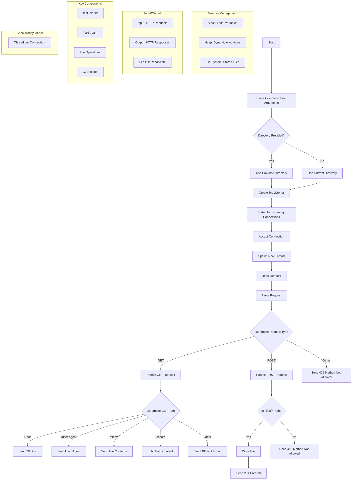

# HTTP Server in Rust from Scratch

This project is a simple HTTP server implemented in Rust. It handles basic HTTP requests, supports gzip compression, and can handle concurrent connections. The server was developed as a learning exercise with guidance from [codecrafters.io](https://codecrafters.io).



## Features

The server handles HTTP GET and POST requests. It supports several endpoints including `/`, `/user-agent`, `/files/{filename}`, and `/echo/{str}`. It also supports gzip compression for responses if requested by the client. Additionally, the server is capable of handling concurrent connections using threads.

## Endpoints

The server provides several endpoints. A GET request to `/` returns a `200 OK` response with an empty body. A GET request to `/user-agent` returns the `User-Agent` header value sent by the client. For the `/files/{filename}` endpoint, a GET request returns the content of the requested file if it exists, otherwise it returns a `404 Not Found` response. The `/echo/{str}` endpoint echoes the string provided in the URL. The server also supports POST requests to the `/files/{filename}` endpoint, saving the request body as a file with the given filename.


Sure! Here’s a detailed explanation of what an HTTP server is, what it does, and what it returns, formatted for inclusion in the README.

## What is an HTTP Server?

An HTTP server is a software application that listens for HTTP requests from clients, typically web browsers, and responds with appropriate HTTP responses. HTTP stands for Hypertext Transfer Protocol, which is the foundation of any data exchange on the Web and is a protocol used for transmitting hypermedia documents, such as HTML.

### How Does an HTTP Server Work?

An HTTP server operates by performing the following steps:

1. **Listening for Requests**: The server listens on a specific IP address and port for incoming network connections. This is similar to how a post office waits for letters to arrive before sorting and delivering them.
   
2. **Accepting Connections**: When a client (like a web browser) wants to communicate, it establishes a connection with the server. The server accepts this connection, much like a receptionist acknowledging a visitor.

3. **Reading Requests**: The server reads the data sent by the client. This data includes the request line (e.g., `GET /index.html HTTP/1.1`), headers (e.g., `User-Agent: Mozilla/5.0`), and an optional body (e.g., form data for a POST request).

4. **Parsing Requests**: The server parses the request to understand what the client is asking for. This involves breaking down the request into its components: the HTTP method (GET, POST, etc.), the requested URL or resource, and any additional headers or body data.

5. **Generating Responses**: Based on the request, the server generates an appropriate response. This includes:
   - **Status Line**: Indicates the result of the request (e.g., `HTTP/1.1 200 OK` for a successful request or `HTTP/1.1 404 Not Found` if the resource is not found).
   - **Headers**: Provide metadata about the response, such as the content type (`Content-Type: text/html`), content length (`Content-Length: 348`), and encoding (`Content-Encoding: gzip`).
   - **Body**: The actual data being returned, which could be an HTML page, an image, JSON data, or any other type of content.

6. **Sending Responses**: The server sends the generated response back to the client. The client then processes the response, rendering a web page, displaying an image, or processing the received data as needed.

7. **Closing or Maintaining Connections**: Depending on the connection type (e.g., `Connection: keep-alive`), the server may either close the connection after sending the response or keep it open for further requests.

### What Does an HTTP Server Return?

An HTTP server returns HTTP responses that consist of the following components:

- **Status Line**: This includes the HTTP version, status code, and a reason phrase. For example, `HTTP/1.1 200 OK` means the request was successful.
  
- **Headers**: These provide additional information about the response. Common headers include:
  - `Content-Type`: Indicates the media type of the resource (e.g., `text/html` for HTML documents).
  - `Content-Length`: Indicates the size of the response body in bytes.
  - `Content-Encoding`: Indicates any encodings applied to the response body (e.g., `gzip`).

- **Body**: This is the actual content being returned. It can be:
  - HTML, CSS, JavaScript files for rendering web pages.
  - Image files (JPEG, PNG, etc.).
  - Data in formats like JSON or XML for API responses.
  - Plain text or any other type of data.

### Example of an HTTP Request and Response

#### HTTP Request Example
```
GET /index.html HTTP/1.1
Host: localhost:4221
User-Agent: Mozilla/5.0
Accept: text/html
```

#### HTTP Response Example
```
HTTP/1.1 200 OK
Content-Type: text/html
Content-Length: 348

<!DOCTYPE html>
<html>
<head>
    <title>Welcome</title>
</head>
<body>
    <h1>Hello, World!</h1>
</body>
</html>
```

In this example, the client requests the `/index.html` resource. The server responds with a `200 OK` status, indicating success, and includes the HTML content of the requested page in the response body.

By understanding these components and how they interact, you gain insight into the fundamental operations of web communication and how servers handle client requests to deliver the appropriate content.

## Usage

To use this project, you need to have [Rust](https://www.rust-lang.org/tools/install) installed. First, clone the repository with the command:
```sh
git clone https://github.com/aadhavr/http-server
cd http-server
```
Build the project using:
```sh
cargo build --release
```
You can then run the server with:
```sh
./target/release/http-server-starter-rust --directory /path/to/serve
```

### Example Requests

You can test the server with various example requests. For instance, a GET request to the root URL can be made using:
```sh
curl -v http://localhost:4221/
```
To test the `/user-agent` endpoint, you can use:
```sh
curl -v -H "User-Agent: custom-agent" http://localhost:4221/user-agent
```
To serve files, create a file and request it as follows:
```sh
echo "Hello, World!" > /tmp/hello.txt
curl -v http://localhost:4221/files/hello.txt
```
For the echo endpoint, use:
```sh
curl -v http://localhost:4221/echo/hello
```
To save data to a file via a POST request, you can use:
```sh
curl -v -X POST --data "This is a test file." http://localhost:4221/files/test.txt
```

## Acknowledgments

This project was inspired by and developed with the help of [codecrafters.io](https://codecrafters.io), which provides excellent resources for learning how to build your own HTTP server from scratch.